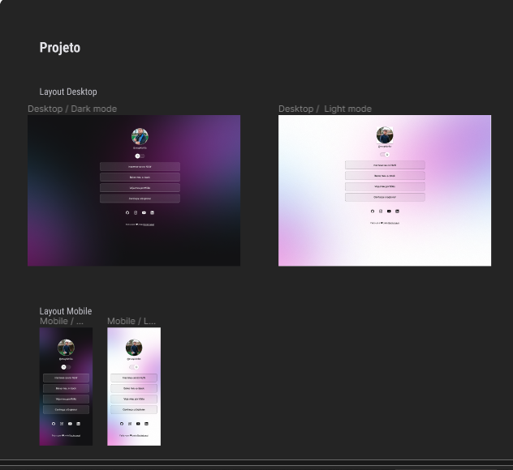

<h1 align="center"> Agregador de Link </h1>

 

  

## 🚀 Tecnologias

Esse projeto foi desenvolvido com as seguintes tecnologias:

- HTML e CSS
- JavaScript
- Git e Github
- Figma

## 💻 Projeto

Olá a todos,
O agregador de link é uma ferramenta poderosa para enfrentar o desafio da sobrecarga de informações online. O "Agregador de Links" é uma solução projetada para simplificar sua exploração na internet, permitindo que você acesse e organize facilmente uma infinidade de conteúdos relevantes. Vamos dar uma olhada mais de perto em como isso pode beneficiar todos nós.

Desafio da Sobrecarga de Informações:
Em uma era onde a internet nos fornece uma avalanche constante de informações, encontrar e acompanhar os conteúdos relevantes se tornou um verdadeiro desafio. A quantidade de blogs, notícias, artigos e recursos disponíveis é esmagadora. Navegar por essa maré de informações pode ser cansativo e muitas vezes nos faz perder tempo valioso.

O Que é um Agregador de Links?:
Imagine um hub central que reúne todos os links interessantes que você encontra na web. É exatamente isso que nosso Agregador de Links faz. Ele atua como uma plataforma única onde você pode salvar, categorizar e acessar facilmente todos os links que deseja manter à mão.

Benefícios para os Usuários:

Organização Simplificada: Diga adeus às abas abertas e à desorganização. Nosso agregador permite que você mantenha todos os links organizados em categorias personalizadas.
Eficiência de Tempo: Com seus links organizados, você economiza tempo ao acessar diretamente o conteúdo desejado, sem precisar repetir buscas.
Personalização Total: Escolha suas categorias de interesse e receba links relevantes diretamente em seu agregador.
Descoberta Contínua: Explore novos conteúdos relacionados aos seus interesses, enriquecendo sua experiência online.
Compartilhamento Simplificado: Compartilhe coleções inteiras de links com amigos, colegas e seguidores com apenas alguns cliques.
Recursos Principais:

Interface Amigável: Nossa plataforma oferece uma interface intuitiva, perfeita para todos os níveis de habilidade.
Categorização Inteligente: Os links são categorizados automaticamente, poupando você do trabalho manual.
Favoritos e Marcadores: Marque os links favoritos para acesso rápido e fácil.
Filtros Avançados: Refine suas seleções com filtros por data, relevância e outras opções.
Sincronização Multiplataforma: Acesse seus links em qualquer dispositivo, a qualquer hora.
Notificações Personalizadas: Receba alertas sobre novos conteúdos nas suas áreas de interesse.
Conclusão:
Nosso Agregador de Links é mais do que uma ferramenta, é um facilitador para sua jornada online. Ele transforma a maneira como você explora a internet, tornando-a mais organizada, eficiente e personalizada. Aproveite o poder de ter suas descobertas online à sua disposição, tudo em um só lugar.

##  Licença

Esse projeto está sob a licença MIT.

## Creditos
 

Programa exclusivo e gratuito, promovido pela Rocketseat para ensino de tecnologias WEB.  
<a href="https://lp.rocketseat.com.br/devlinks/inscricao?utm_source=github&utm_medium=descricao&utm_campaign=capture-devlinks&utm_term=organic&utm_content=descricao-github-mayk-brito">Estude esse projeto em formato de vídeo clicando aqui.</a>

